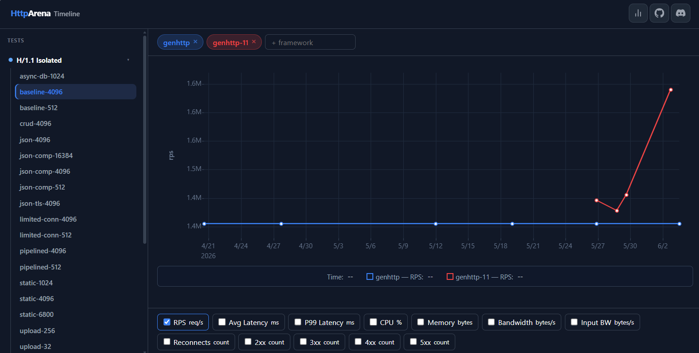

# HttpArena Timeline

A historical view of [HTTP Arena](https://www.http-arena.com) benchmark results, allowing framework maintainers and users to track performance changes over time.

**[Open the Timeline →](https://timeline.http-arena.com/)**

---



---

## What is this?

[HTTP Arena](https://www.http-arena.com) runs regular benchmarks across dozens of web frameworks and languages, measuring throughput, latency, CPU usage, memory consumption, and more. The results on the site reflect only the most recent run. This project fills the gap by recording every benchmark run into a time series, making it possible to answer questions like:

- Did this release improve throughput?
- When did latency regress, and by how much?
- How does a framework trend compared to its historical baseline?

## How it works

The project has two components:

**Import process** — a C# tool that walks the git history of the [HTTP Arena repository](https://github.com/danielHalan/HttpArena) and extracts benchmark result files from each relevant commit. Results are written as static JSON files under `data/<framework>/<test>-<concurrency>.json`, deduplicated so that only runs with a meaningful RPS change (or a gap of 7+ days) are recorded.

**SPA** — a client-side web application that reads the static JSON files and renders interactive time-series graphs. Select a framework, then a test, and explore how any metric has evolved over time.

Because everything is static JSON served from GitHub Pages, no backend infrastructure is required.

## Data format

Each timeline file has the following structure:

```json
{
  "data": [
    ["2025-01-01T10:22:00Z", { "rps": 43000, "avg_latency_ms": 1.2, "p99_latency_ms": 3.5, ... }],
    ["2025-01-08T10:22:00Z", { "rps": 43500, "avg_latency_ms": 1.1, "p99_latency_ms": 3.3, ... }]
  ]
}
```

An `index.json` at the root of `data/` lists all available frameworks and tests for the SPA to enumerate.

## Running the import locally

```bash
dotnet run --project src/Importer/Importer.csproj [<repo-path> [<output-path> [<starting-commit>]]]
```

Defaults point to `../HttpArena` as the source repository and `./data` as the output directory.

## License

MIT
